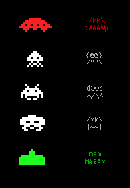
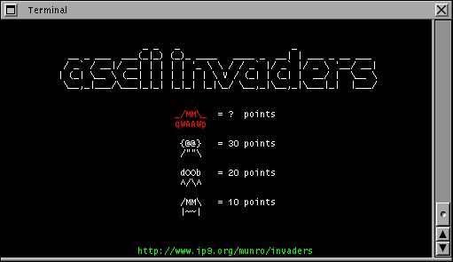
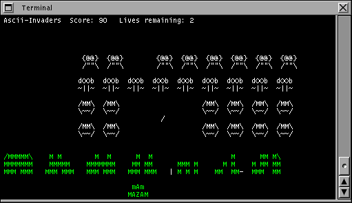
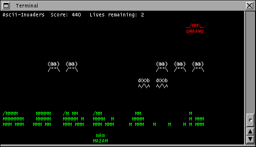
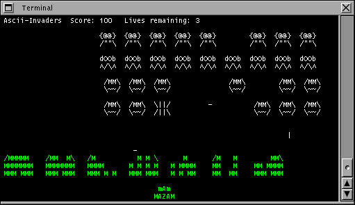

ascii-invaders
==============

An ASCII-art game like Space Invaders

This is short bit of C code I wrote back in 2001 and published on my
erstwhile home page:

 http://web.archive.org/web/20100417061809/http://www.ip9.org/munro/invaders/

Looking at it more than a decade later, there are two unforgivable flaws!

1.  It does illegal things inside a signal handler!
2.  It uses global variables in order to do so.

I really must get around to fixing this.  It should probably use select
for timing instead signals.

I am embarassed to admit that I did not do anything with several patches
that people have sent me by email over the years to make it work on 
various platforms.   Sorry!

artwork
=======

Original vs ASCII:

Screen shots (I think this must have been 2001-era Gnome Terminal!):

